# unipiLibrary

Υπηρεσία ψηφιακής πύλης της δανειστικής βιβλιοθήκης του Πανεπιστημίου Πειραιώς-Unipi Library

## Περιεχόμενα
* [Σύστημα](#Το-σύστημα)
* [Βάση](#Η-βάση)
* [Εγκατάσταση και εκτέλεση](#Εγκατάσταση-και-εκτέλεση)
* [Λειτουργίες Συστήματος](#Λειτουργίες-Συστήματος)
  * [Authentication](#Authentication)
  * [User](#User)
  * [Administrator](#Administrator)

## Το σύστημα
Το πληροφοριακό σύστημα, το οποίο παρέχει την υπηρεσία unpiLibrary, αποτελείται από 2 container.
Στο ένα περιέχεται η βάση δεδομένων (mongoDb), ενώ στο άλλο η υπηρεσία. Η υλοποίηση των services αυτών γίνεται με python, χρησιμοποιώντας εργαλεία flask και pymongo για την υλοποίηση της web-εφαρμογής και της επικοινωνίας με τη βάση αντίστοιχα. Για τη δημιουργία των interfaces χρησιμοποιήθηκε HTML και CSS.

## Database
Χρησιμοποιούνται 3 collections σε μια βάση MongoDb με την εξής δομή:
* Το πρώτο collection ονομάζεται users και περιέχει όλες τις πληροφορίες ενός χρήστη.

users:

| firstname    | surname    | email       | mobile      | password    | dateofbirth     | category   | 
| ----------- | ----------- | ----------- | ----------- | ----------- | --------------- | ---------- |
| string      | string      | string      | string      | string      | Date            | string     | 


* To δεύτερο collection ονομάζεται books και περιέχει όλα τα βιβλία που είναι καταχωρημένα στο σύστημα της βιβλιοθήκης.

books:

| title    | author   | publicationdate       | isbn     | summary | pagesnum | reservationdays |
| -------- | -------- | --------------------- | -------- | ------- | -------- | --------------- | 
| string   | string   | string                | string   | string  | int      | int             |

* To τρίτο collection ονομάζεται reservedbooks και περιέχει όλα τις κρατήσεις βιβλίων που έχουν γίνει και είναι καταχωρημένες στο σύστημα.

reservedbooks:

| Title            | Author         | ISBN             | User                                   | Reservation                        |
|------------------|----------------|------------------|----------------------------------------|------------------------------------|
| string           | string         | string           | object                                 | object                             |

*Τα user και reservation έχουν τα στοιχεία του χρήστη που έχει δανειστεί το βιβλίο και της ημερομηνίας κράτησης και επιστροφής αντιστοίχως.

user:

| firstname | surname | email   | mobile | 
|-----------|---- ----|---------|--------|
| string    | string  | string  | string |

reservation:

| reservationdate | returndate | 
|-----------------|------------|
| date            | date       | 
 
 *Κατα την εκτέλεση δημιουργείται ο λογαριασμός ενός διαχειριστή με στοιχεία firstname: Admin, surname: User, email: admin@email.com, password: admin, dateofbirth: 2001-07-13 και category: admin. Επίσης δημιουργείτε ένας λογαριασμός ενός απλού χρήστη με στοιχεία firstname: Vincent, surname: Peters, email: vin@email.com, password: 12345, dateofbirth: 2000-04-27 και category: user.*

## Εγκατάσταση και εκτέλεση

Η εγκατάσταση και εκτέλεση του συστήματος γίνεται με τα παρακάτω βήματα*:

1. Clone αυτού του repository τοπικά.
2. Εκτέλεση της παρακάτω εντολής στο local directory που αποθηκεύτηκε το repository:

```bash
sudo docker-compose up --build
```
 *Βασική προϋπόθεση να υπάρχει εγκατεστημένη έκδοση docker*

## Λειτουργίες Συστήματος

##  Authentication

### SignIn Page
Η σελίδα σύνδεσης είναι η πρώτη σελίδα που θα εμφανιστεί σε κάθε χρήστη μόλις συνδεθεί στη διεύθυνση '[0.0.0.0:5000](http://127.0.0.1:5000/)'.
Σε αυτή τη σελίδα ένας ήδη καταχωρημένος χρήστης μπορεί να κάνει εισαγωγή στην εφαρμογή εισάγωντας το email του και password.
Σε περίπτωση που κάποιος νέος χρήστης δεν έχει λογαριασμό του, μπορεί να μεταβεί στην 'SignUp' σελίδα για να δημιουργήσει νέο λογαριασμό.


### SignUp Page
Στη σελίδα εγγραφής ο χρήστης μπορεί να δημιουργήσει έναν νέο λογαριασμό για να μπορέσει να εισέλθει στην εφαρμογή.
Δε μπορεί να δημιουργήσει λογαριασμό με email που είναι ήδη κατωχηρωμένα στο σύστημα.


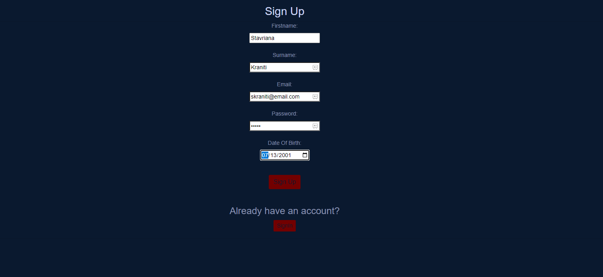

Αν προσπαθήσει να κάνει εγγραφή με μέιλ που ήδη υπάρχει στο σύστημα του τότε θα εμφανιστεί το εξής μήνυμα:


## User
### Homepage
Ένας εγγεγραμμένος χρήστης αφού εισάγει επιτυχώς τα στοιχεία του και εισέλθει στην υπηρεσία θα μεταφερθεί αυτόματα στην κύρια σελίδα στην οποία μπορεί να δει το navigation bar με όλες τις ενέργειες τις οποίες μπορεί να εκτελέσει καθώς και ένα welcome message.
Μέσω του Navigation Bar, όπως μόλις αναφέρθηκε μπορεί να περιηγηθεί στις λειτουργίες που παρέχει η υπηρεσία.


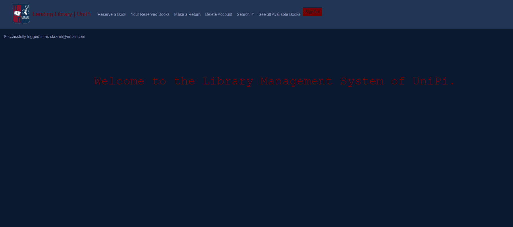

### Κράτηση Βιβλίου
Σε αυτή τη σελίδα ο χρήστης μπορεί να κάνει κράτηση ενός βιβλίου από αυτά που υπάρχουν στο σύστημα, εισάγοντας το κωδικό ISBN, που είναι μοναδικός για κάθε βιβλίο καθώς και ένα τηλέφωνο επικοινωνίας. 

*(Τα προσωπικά του στοιχεία που απαιτούνται για την κράτηση, παίρνονται αυτόματα από τον λογαριασμό του χρήστη που είναι συνδεδεμένος και δεν έχει δικαίωμα να τα επεξεργαστεί.)*


Στην περίπτωση που το βιβλίο είναι ήδη κρατημένο από κάποιο άλλο χρήστη, θα εμφανίζεται αντίστοιχο μήνυμα.


### Επιστροφή Βιβλίου
Σε αυτή τη σελίδα ο χρήστης μπορεί να ακυρώσει μία κράτηση που έχει κάνει εισάγωντας το μοναδικό κωδικό της κράτησης. 

*Το μοναδικό κωδικό της κάθε κράτησης μπορεί να τον δει στη σελίδα των  κρατήσεων του.*

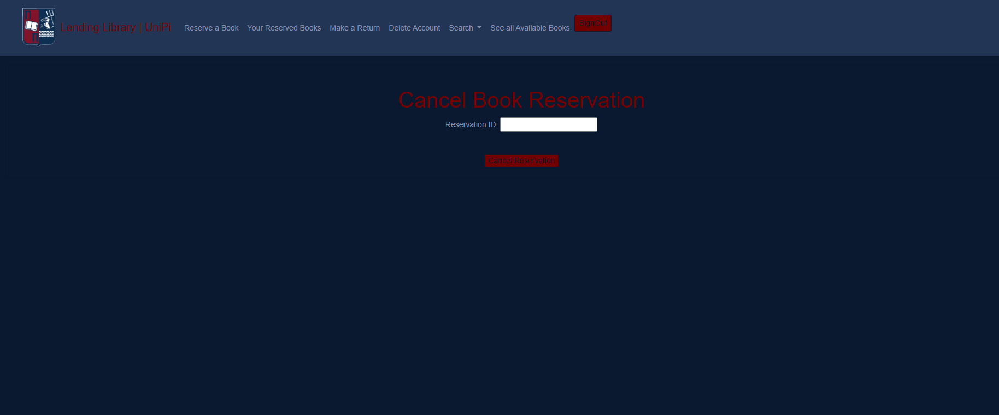

### Εμφάνιση Κρατήσεων Χρήστη
Σε αυτή τη σελίδα εμφανίζονται όλες οι κρατήσεις που έχει κάνει ο συγκεκριμένος χρήστης.

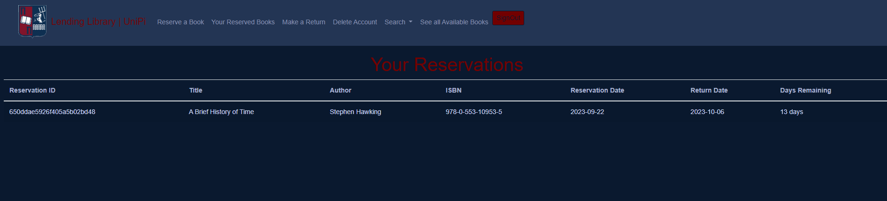

### Διαγραφή λογαριασμού
Ο χρήστης μπορεί να διαγράψει το λογαριασμό του. Ωστόσο οποιαδήποτε κράτηση έχει κάνει θα παραμείνει στο σύστημα.
Έπειτα ο χρήστης θα μεταφέρεται στη σελίδα εγγραφής σε περίπτωση που θέλει να δημιουργήσει νέο λογαριασμό.

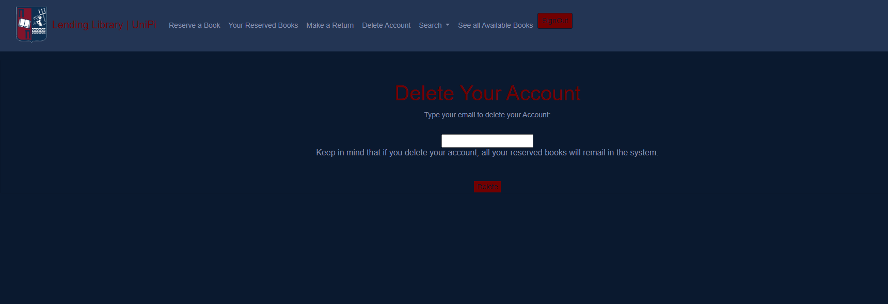

### Αναζήτηση Βιβλίου μέσω Τίτλου
Ο χρήστης να κάνει αναζήτηση ενός βιβλίου βάση του Τίτλου του.


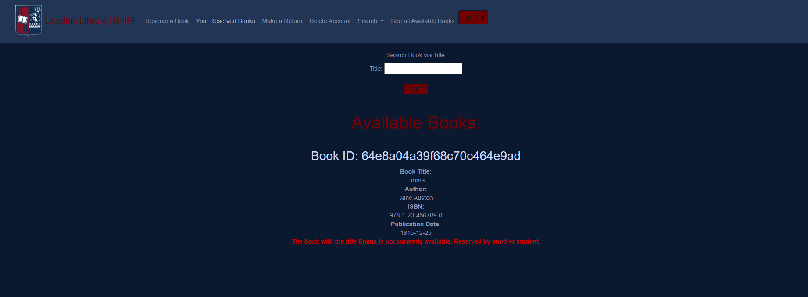

Στην περίπτωση που το βιβλίο είναι κρατημένο από κάποιο χρήστη εμφανίζεται ανάλογο μήνυμα όπως φαίνεται στην εικόνα.

*(To Book ID αναφέρεται στο μοναδικό κωδικό κωδικό που έχει το βιβλίο στο σύστημα και ΟΧΙ στον επίσημο ISBN κωδικό του.)*

### Αναζήτηση Βιβλίου μέσω Συγγραφέα. 
Ο χρήστης να κάνει αναζήτηση ενός βιβλίου βάση του Συγγραφέα.


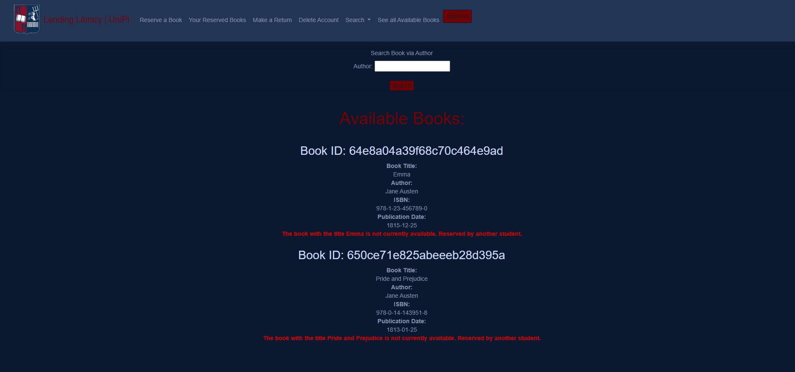

Στην περίπτωση που το βιβλίο είναι κρατημένο από κάποιο χρήστη εμφανίζεται ανάλογο μήνυμα όπως φαίνεται στην εικόνα.

*(To Book ID αναφέρεται στο μοναδικό κωδικό κωδικό που έχει το βιβλίο στο σύστημα και ΟΧΙ στον επίσημο ISBN κωδικό του.)*

### Αναζήτηση Βιβλίου μέσω ISBN. 
Ο χρήστης να κάνει αναζήτηση ενός βιβλίου βάση κωδικού ISBN.

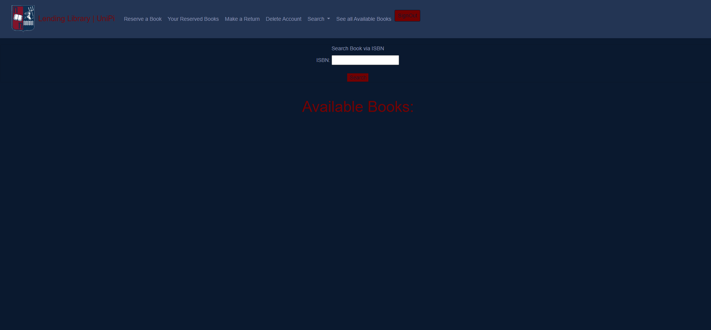
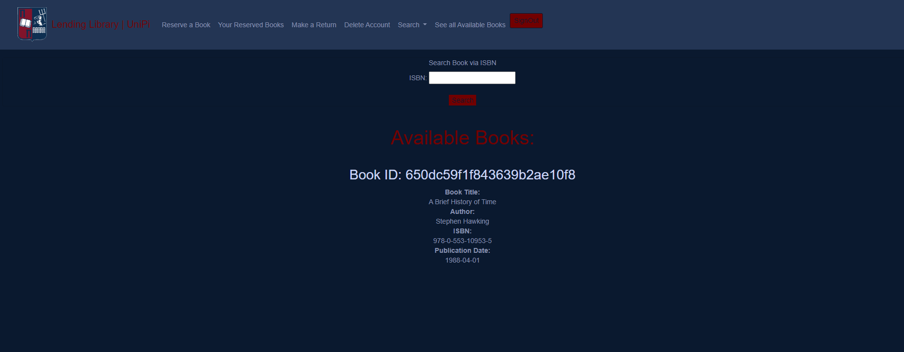

Στην περίπτωση που το βιβλίο είναι κρατημένο από κάποιο χρήστη εμφανίζεται ανάλογο μήνυμα όπως φαίνεται στην εικόνα.

*(To Book ID αναφέρεται στο μοναδικό κωδικό κωδικό που έχει το βιβλίο στο σύστημα και ΟΧΙ στον επίσημο ISBN κωδικό του.)*

### Αναζήτηση Βιβλίου μέσω Ημερομηνίας Έκδοσης. 
Ο χρήστης να κάνει αναζήτηση ενός βιβλίου βάση Ημερομηνίας Έκδοσης.


Στην περίπτωση που το βιβλίο είναι κρατημένο από κάποιο χρήστη εμφανίζεται ανάλογο μήνυμα όπως φαίνεται στην εικόνα.

*(To Book ID αναφέρεται στο μοναδικό κωδικό κωδικό που έχει το βιβλίο στο σύστημα και ΟΧΙ στον επίσημο ISBN κωδικό του.)*

### Προβολή όλων των βιβλίων που βρίσκονται στο Συστήμα. 
Ο χρήστης να δει όλα τα βιβλία που βρίσκονται στο σύστημα καθώς και την διαθεσιμότητά τους.


Αναλόγως την διαθεσιμότητα του βιβλίου θα εμφανίζεται ✔ ή x αντιστοίχως

*(To Book ID αναφέρεται στο μοναδικό κωδικό κωδικό που έχει το βιβλίο στο σύστημα και ΟΧΙ στον επίσημο ISBN κωδικό του.)*

### Προβολή Διαθέσιμων Βιβλίων
Σε αυτή τη σελίδα ο χρήστης μπορεί να δει όλα τα διαθέσιμα για κράτηση βιβλία τα οποία υπάρχουν στο σύστημα.

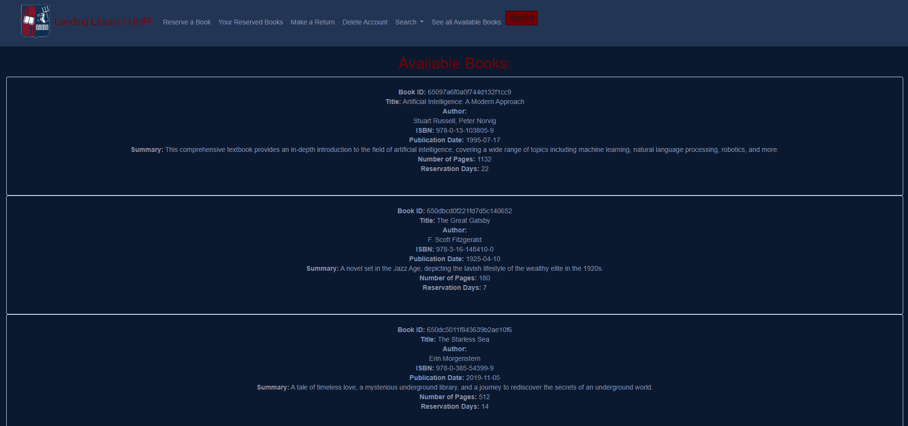

## Administrator

### Home page
Αν κάποιος εισέλθει στο σύστημα ως διαχειριστής μεταφέρεται στο αντίστοιχο Homepage.
Μέσω του Navigation Bar μπορεί να περιηγηθεί στις λειτουργίες που παρέχει η υπηρεσία.


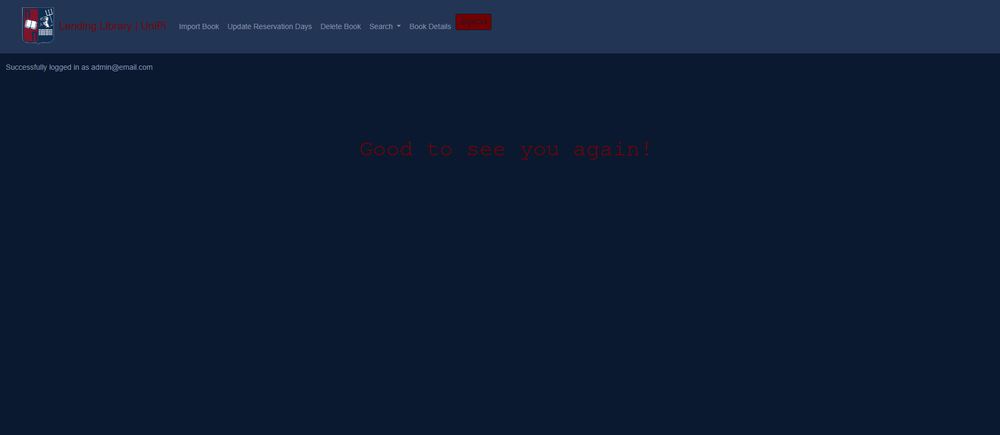


### Εισαγωγή Βιβλίου
Σε αυτή τη σελίδα ο διαχειριστής μπορεί να δημιουργήσει νέα εγγραφή βιβλίου, εισάγοντας τα παρακάτω στοιχεία:
Title, Author, Publication Date, ISBN, Summary, Book Pages, Reservation Days


### Ενημέρωση Μερών Κράτησης 
Σε αυτή τη σελίδα ο διαχειριστής μπορεί να ανανεώνει τις μέρες κράτησης ενός βιβλίου. Πλκτρολογεί τον ISBN κωδικό του βιβλίου που επιθυμεί και έπειτα συμπληρώνει το νέο αριθμό για τις μέρες κράτησης. Αν αυτό το βιβλίο βρεθεί στο σύστημα, θα ανανεωθούν οι μέρες κράτησης.

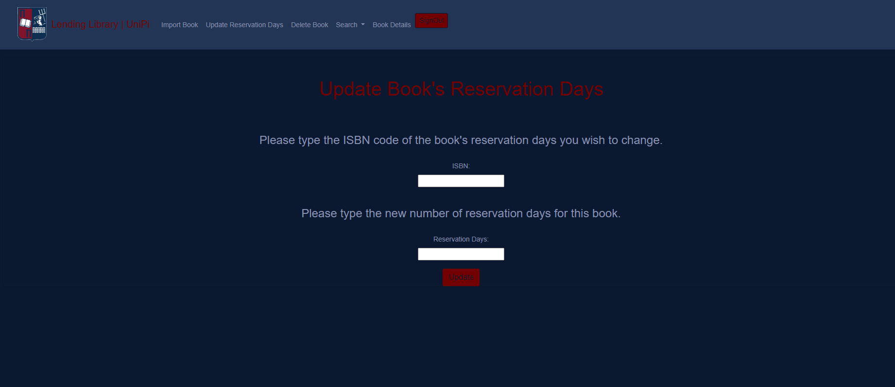

### Διαγραφή Πτήσης
Ένας διαχειριστής μπορεί να διαγράφει κάποια πτήση, πληκτρολογώντας το μοναδικό κωδικό της. Απαραίτητη προϋπόθεση είναι να μην έχει γίνει καμοία κράτηση για αυτή τη πτήση, αλλιώς η διαγραφή της δεν είναι δυνατή. 


### Αναζήτηση σημείωσης μέσω Αεροδρομίου Προέλευσης και Προρισμού 
Ο χρήστης να κάνει αναζήτηση μιας πτήσης βάση του Αεροδρομίου Προέλευσης και Προορισμού.


### Αναζήτηση σημείωσης μέσω Αεροδρομίου Προέλευσης και Προρισμού και ημερομηνίας αναχώρησης. 
Ο χρήστης να κάνει αναζήτηση μιας πτήσης βάση του Αεροδρομίου Προέλευσης και Προορισμού και της ημερομηνίας αναχώρησης.


### Αναζήτηση σημείωσης μέσω ημερομηνίας αναχώρησης. 
Ο χρήστης να κάνει αναζήτηση μιας πτήσης βάση ημερομηνίας αναχώρησης.


### Πληροφορίες Πτήσης
Αν ο χρήστης επιθυμεί να δει τις πληροφορίες μίας πτήσης, τότε σε αυτή τη σελίδα, θα εισάγει το μοναδικό κωδικό της πτήσης που επιθυμεί.


